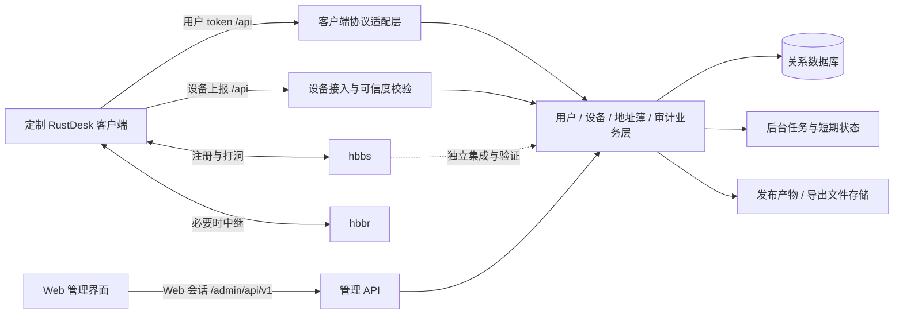

# RustDesk 定制客户端与 API 服务：差异分析及 Web 管理改造方案

> 分析日期：2026-09-28。本文是代码审查和改造设计，不是已上线功能说明。只新增文档，不修改两个项目的业务代码、数据库或部署配置。
>
> **核心建议：保留现有 RustDesk 客户端及其 `/api/*` 兼容契约，重建服务端的身份、设备、地址簿和审计模型，再建设独立 Web 管理界面。不要直接在两个 `index.php` 上继续堆页面，也不要把地址簿权限等同于远程连接强制授权。**

## 1. 结论与阅读导航

### 1.1 已确认的事实

| 结论 | 置信度 | 依据 |
| --- | --- | --- |
| 你的客户端是近期官方 RustDesk 主线加少量定制，并非另写了一套远控协议 | 高 | 官方共同基线 `0d49ead0c`，本地其后 10 个提交 |
| 绝大部分 HTTP API 调用能力来自官方客户端，你的改动主要让它容忍旧 PHP 服务的不规范响应 | 高 | `71407a6a0` 只调整登录选项和地址簿能力探测 |
| 本地 API 是旧版客户端兼容脚本，没有完整 Web 后台 | 高 | SQLite 410 行、MySQL 314 行；没有前端工程；截图是客户端界面 |
| 目前不能从 API 的心跳结果获得可信设备在线状态，也没有持久化 sysinfo 和连接审计 | 高 | 处理器返回固定文本或固定 JSON |
| 当前最重要的改造不是页面美化，而是权限、协议、数据完整性及身份可信度 | 高（设计判断） | 可预测 token、SQL 拼接、全量地址簿覆盖、无设备身份验证等代码证据 |
| 可以复用客户端已有心跳、审计和新版地址簿能力，减少 Flutter/Rust 修改 | 高（能力存在）；运行兼容待验证 | 调用与解析逻辑存在，但当前 PHP 没有对应业务实现 |
| “浏览器管理”“浏览器直接远控”“服务端强制连接授权”是三项独立工程 | 高 | HTTP 管理层、客户端媒体/输入链路、hbbs/hbbr 信令与鉴权分别承担不同职责 |

### 1.2 推荐阅读顺序

1. [版本基线](#2-版本基线与比较方法)、[定制差异](#3-定制客户端差异及其对后台的影响)、[接口矩阵](#4-客户端api-接口兼容矩阵)。
2. [现有后端问题](#5-当前-api-的问题清单及优先级)、[四个参考项目](#6-四个参考项目的源码对比与取舍)。
3. [总体架构](#7-推荐总体架构与技术路线)、[Web 页面](#8-web-页面与用户工作流)、[数据模型](#9-数据模型设计)、[身份权限](#10-认证授权与设备接入)、[同步与管理-api](#11-地址簿并发与管理-api-设计)。
4. [迁移回滚](#12-旧数据迁移与切换方案)、[部署运维](#13-部署容量和运维)、[实施阶段](#14-实施阶段交付物和决策门槛)、[验收矩阵](#15-验收矩阵)。
5. [代码证据及验证边界](#16-证据索引复核方法和限制)。

### 1.3 方案成立的默认条件

以下是设计假设，不是已知业务事实：首期服务单个组织；已有设备和账号需要迁移；继续使用你的定制客户端；以 Windows x64、macOS ARM64、Android ARM64 为主要发布平台；先交付设备与地址簿管理，再扩展共享、策略和会话操作。实际设备数量、管理员人数、保留期和部署数据库尚未提供，因此本文给容量计算方法，不宣称已达到某种规模。

## 2. 版本基线与比较方法

### 2.1 本次固定的版本

| 对象 | 版本/提交 | 说明 |
| --- | --- | --- |
| 本地 `rustdesk` | `b8ac4f93cab25f892ff259dd33310d8bdc4b85b3` | `master`；Cargo 版本 `1.5.0` |
| 官方 `rustdesk/rustdesk` master | `4812a9815bd3c6a93f3ad903f29504168c4930a1` | 本次实际查询并获取的官方 HEAD |
| 本地与官方共同基线 | `0d49ead0c37756095572eec74bc7ee7988fc58ea` | 定制差异应该相对这个提交统计 |
| 基线 hbb_common 子模块 | `229b904508364c8997aad0fb5af57effac859f60` | 下载官方此提交并逐文件对比 |
| 本地 `rustdesk-api` | `bce7dca996e84cf1b258573d5b95fc5dfee544cc` | 最新提交时间 2025-04-03；README 描述主要面向 1.2.x |

两个本地仓库的 origin 都指向你的 GitHub fork，而非官方仓库。开始分析时，两个工作区都有未跟踪的 `.spec-workflow/`，本次没有修改它们。官方取证放在临时目录，没有给你的仓库添加 upstream 或切换分支。

### 2.2 为什么不能直接按文件数量判断定制规模

相对共同基线，原始 diff 为 **54 个文件、15,550 行新增、130 行删除**。其中大量新增来自 `libs/hbb_common` 从 Git 子模块变成普通目录，并不是这些代码都由你重写。

排除 `libs/hbb_common` 路径后，是 **25 个文件、2,268 行新增、129 行删除**；其中新增的 `flutter-build-vumstar.yml` 就占 2,062 行。与官方原子模块快照逐文件比较，`hbb_common` 只有 `src/config.rs` 不同：默认 rendezvous server 与公钥常量被替换。

因此实际业务定制集中在：默认连接配置、固定密码及选项、SOS 界面、旧 API 容错、hbbs 握手兼容、构建发布配置。该结论比“修改了上万行核心代码”更准确。

### 2.3 本地与上游各自的后续提交

本地相对共同基线的 10 个提交：

| 提交 | 改动主题 |
| --- | --- |
| `1ea6d819f` | 初始定制配置、界面、hbb_common 内置化、额外构建流程 |
| `6580c14ea` | 编译定制默认值、限制 tag 构建 |
| `c381da057` | hbbs 1.1.16 兼容、standard/SOS 构建 |
| `f59b4cf02` | macOS 可变 interval 编译修正 |
| `92325133b` | 手动发布 1.5.0、macOS ad-hoc 签名 |
| `655e89222` | ad-hoc 签名不启用 hardened runtime |
| `71407a6a0` | 兼容旧 rustdesk-api 登录选项和地址簿 |
| `b8b6bde38` | SOS 首页标题 |
| `4e84f85a3` | 产物名称包含 edition |
| `b8ac4f93c` | 收敛到 macOS ARM、Windows x64、Android arm64 |

官方另有 3 个后续提交：`d1722c5d6`（Linux 虚拟鼠标）、`b6b11fd9b`（DRM/uinput 线程调整）、`4812a9815`（AGENTS 指引）。它们不是你的定制功能。后续合并上游仍需要回归测试，不能因为这次差异少就自动判定无风险。

## 3. 定制客户端差异及其对后台的影响

### 3.1 配置、身份及安全默认值

| 差异 | 当前行为 | 对 Web 改造的影响 |
| --- | --- | --- |
| 默认 ID 服务器和公钥 | `hbb_common/src/config.rs:117` 附近替换官方常量 | 设备需要关联 server profile；公钥是公开信任材料，不应与用户密码混用 |
| 默认 API | `src/common.rs:1162` 替换官方管理域名 | 保留现有 API 域名反向代理是低风险迁移方式 |
| 固定远程密码 | `load_custom_client` 把同一个字面值写入 HARD_SETTINGS | 发布前优先消除共享固定密码；后台改密码未必能覆盖 HARD_SETTINGS |
| 仅永久密码验证 | 同一函数硬设 `verification-method` | 与临时协助/SOS 产品语义不完全一致；不能把 SOS 自动当作一次性授权 |
| 默认允许远程配置修改 | DEFAULT_SETTINGS 写入允许项 | 不等于任意 HTTP 接口都可以改客户端配置；必须看实际连接权限和策略链路 |
| 默认允许隐藏连接管理窗口 | DEFAULT_SETTINGS 与设置页面开关 | 后台需要记录具体配置版本；建议可见、可解释的受控策略，不再作为所有版本隐含默认 |

本文不抄录源码中的密码或数据库连接密码。共享固定远程密码是已确认的代码事实；它在每个具体发行包上的最终行为仍需结合打包配置与启动路径验证。

API 地址也不是永远取硬编码兜底值。`get_api_server_` 的次序包括 Windows 文件名配置、显式 API 配置、自定义 rendezvous server 派生地址、最后的默认 API。自定义 ID 服务器可能派生出 HTTP `21114` 地址。因此后台的“接入配置检查”应显示客户端实际解析后的 API URL、ID server、公钥指纹与版本，不能只显示默认模板。

### 3.2 SOS 是界面裁剪，不是新认证模式

`RUSTDESK_SOS=1` 通过 `apply_edition_defaults` 设置 `sos-mode=Y`。桌面界面据此隐藏右侧连接区域、服务器配置入口、菜单等。`isIncomingOnly()` 仍然是单独判断，不能把隐藏入口当作协议级限制。

后台建议区分三种属性：`build_edition`（standard/SOS）、`device_role`（运维端/被控端）、`enrollment_status`（待认领/已认领/撤销）。当前 sysinfo 没有一个已经证实会上报的 edition 字段；后续如需准确展示，需要扩展客户端上报或在部署登记中记录。不能仅凭 `version=1.5.0` 推断 edition。

SOS 的一期合理流程：客户端下载 → 设备上报待认领 → 用户明确完成接入/认领 → 运维人员按授权查看与连接 → 保留会话记录。一次性协助码、自动过期和连接审批属于新增能力，现有 `sos-mode` 本身并未实现。

### 3.3 旧 API 容错不是完整协议升级

`71407a6a0` 做了两类改动：

- `/api/login-options` 返回空串或非 JSON 前缀时，客户端按无第三方登录选项处理。
- `/api/ab/settings`、`/api/ab/personal`、`/api/ab/shared/profiles` 返回 404 或空响应时，按不支持该能力处理。

这能绕开旧 PHP 返回 `ok` 或未知路由空白的情况，但不能代替服务端契约。当前检查可能把空 body 的 401/500 也当作“旧版能力缺失”，从而掩盖真实故障；HTML 错误页在登录选项路径上也可能被忽略。新版服务应该返回正确状态码与机器可解析响应，之后再评估收窄客户端容错，不建议长期加更多猜测式兼容。

### 3.4 hbbs 兼容与“登录后连接变慢”

`src/common.rs` 的 key exchange 将等待调整为 3,000ms 探测，对超时返回未完成交换，而不是直接传播同样的超时错误。源码注释说明这是针对 hbbs 1.1.16 不先发握手消息的兼容。

`src/client.rs:850` 的路径条件是：存在 key 且存在 token 或 switch code 时进入 legacy secure 路径。登录 API 会产生 token，所以“登录前后连接体验不同”确实存在代码上的关联，但它横跨 HTTP 登录和 rendezvous 握手，不能全部归因于 PHP。

**判断边界：**本次没有连接实际 hbbs/hbbr，不能声称慢连接已彻底解决；3 秒探测仍可能产生延迟，且需要验证延迟消息、重连、relay、WebRTC 降级等路径。也不应继续沿用旧 README 的“清空公钥即可”作为正式方案。API 管理账号权限与 hbbs 实际连接授权必须分别验证。

### 3.5 发布与长期维护

- 当前主构建收敛到 Windows x64、macOS ARM64、Android ARM64；主流程 Web/Linux 构建关闭。存在另一个 `*-vumstar` 工作流，不应把主流程的结论外推到所有工作流。
- 手动构建有 standard/SOS 选择，tag 路径可能默认 SOS；下载中心应以真实构建元数据区分，不能只按版本号。
- macOS ad-hoc 签名与受信 Developer ID 签名/公证不是一回事。后台展示签名状态与 SHA-256，不要把“有签名步骤”展示成“已公证”。
- `hbb_common` 内置化后需要记录其上游提交和补丁清单；否则后续主仓库升级可能配上旧公共库。可恢复锁定子模块或维护独立补丁，但应单独评估，不在后台开发时顺手重构。

## 4. 客户端—API 接口兼容矩阵

### 4.1 三类接口必须分开

| 类别 | 当前认证特征 | 服务端应该承担的职责 |
| --- | --- | --- |
| 用户会话/地址簿接口 | Flutter 读取本地 access_token，发送 Bearer | 身份认证、会话撤销、对象级授权 |
| 设备 sysinfo/heartbeat/audit | 当前 Rust 调用传空 token，包含自报 id/uuid | 接入控制、可信度标记、设备认证演进、限流及数据校验 |
| 浏览器管理接口（拟新增） | 当前不存在 | 独立 Web 会话、角色与数据范围、CSRF、防误操作、管理审计 |

不能给所有 `/api/*` 一刀切加用户 Bearer 验证，否则没有用户登录的被控设备会停止上报；也不能反过来把无 token 的设备上报接口升级成无认证的管理命令通道。

### 4.2 旧版基础接口

PHP 大多数分支只匹配路径，不限制方法。下表“方法”是本地客户端实际调用方式，不表示旧后端做了正确方法校验。

| 接口 | 方法/主要输入 | 当前 SQLite | 当前 MySQL | 改造要求 |
| --- | --- | --- | --- | --- |
| `/api/login` | POST，username/password/id/uuid；新版还有 type、autoLogin、deviceInfo 等 | 有 | 有 | 保留 type/access_token/user 契约；随机 token、禁用状态、会话有效期 |
| `/api/currentUser` | POST，id/uuid + Bearer | 有 | 有 | 校验账号状态与会话，不只查 token 表 |
| `/api/logout` | POST，id/uuid + Bearer | 有 | 有 | 幂等撤销当前会话；浏览器退出走独立接口 |
| `/api/login-options` | GET | 返回 `ok` | 返回 `ok` | 未启用 OIDC 时返回 JSON `[]` |
| `/api/users` | GET，current/pageSize/accessible/status | 返回所有用户名 | 无该实现 | 按权限范围返回，避免无意义泄露用户目录 |
| `/api/peers` | GET，同类分页参数 | 当前 UID 的地址簿记录 | 无该实现 | 区分资产清单与地址簿视图，保持客户端所需 info 结构 |
| `/api/device-group/accessible` | GET，分页 | 无 | 无 | 未实现前规范 404；上线时仅返回可见组 |
| `/api/ab` | GET | 返回旧地址簿 | 有 | `data` 是 JSON 字符串，不可直接改成对象 |
| `/api/ab` | POST，`{"data":"序列化地址簿"}` | 删除再插入；hash 有缺陷 | 删除再插入 | 原子事务、空集合语义、并发策略、保留未知字段 |
| `/api/sysinfo` | POST，id/uuid/version/hostname/os/cpu/memory 等 | `ok`，不落库 | `ok`，不落库 | **目标：**成功持久化后返回精确文本 `SYSINFO_UPDATED` |
| `/api/heartbeat` | POST，id/uuid/ver/conns/modified_at | 固定 JSON | 固定 JSON | 目标：更新 last_seen，按协议条件返回 sysinfo；策略/断连后期接入 |
| `/api/audit/conn` | POST，连接事件或备注 | `ok`，不落库 | 固定/空响应（无持久化） | 持久化事件、区分事件类型、去重、处理大整数 |
| `/api/audit` | PUT，guid/note + Bearer | 无 | 固定 JSON，不存备注 | 这是客户端另一条会话备注路径；按可访问会话授权 |
| `/api/audit/file` | POST，文件审计 | 无 | 无 | 保留原始字段及 nonce；不要承诺完整文件清单 |
| `/api/audit/alarm` | POST，告警审计 | 无 | 无 | typ/info/nonce 解析，按设备隔离 |

### 4.3 新版个人/共享地址簿接口

这些接口在当前 PHP 后端均未完整实现，但本地客户端已有调用代码。

| 路径 | 方法 | 关键契约 |
| --- | --- | --- |
| `/api/ab/settings` | POST，空 body | JSON 对象，包含 `max_peer_one_ab` |
| `/api/ab/personal` | POST，空 body | JSON 对象，包含稳定 `guid`；返回后客户端切换新版个人地址簿 |
| `/api/ab/shared/profiles` | POST，分页在 query | `{total,data:[{guid,name,owner,note,rule,info}]}` |
| `/api/ab/peers` | POST，query 含 `ab/current/pageSize` | `{total,data:[Peer...]}` |
| `/api/ab/tags/{guid}` | POST | 顶层 JSON 数组 `[{name,color}]`，不是 `{data:[]}`；color 必须为整数 |
| `/api/ab/peer/add/{guid}` | POST，单个 Peer | 个人本去掉 password；共享本去掉 hash |
| `/api/ab/peer/update/{guid}` | 客户端使用 PUT，id + 局部字段 | 旧 PHP 多数分支只按 `s` 路由、不严格校验 HTTP 方法；新服务应严格限制 PUT。未提供字段不变；空值与缺字段语义不同 |
| `/api/ab/peer/{guid}` | DELETE，JSON ID 数组 | 删除指定地址簿条目，不是删除全局资产 |
| `/api/ab/tag/add/{guid}` | POST，name/color | 创建标签 |
| `/api/ab/tag/rename/{guid}` | PUT，old/new | 重命名并同步条目关联 |
| `/api/ab/tag/update/{guid}` | PUT，name/color | 更新颜色 |
| `/api/ab/tag/{guid}` | DELETE，JSON 名称数组 | 删除标签关联，保留设备 |

`rule` 的客户端枚举是 1=只读、2=读写、3=完全控制。这是地址簿资源权限，不能直接解释为远程会话允许键鼠/文件/终端的权限位。服务端必须在每次访问 guid 时重新做 ACL 校验，不能只依赖前端是否显示按钮。

**能力切换的发布约束：**不要先上线 `/api/ab/personal` 返回 guid，再慢慢补 peers/tags CRUD。客户端会因 guid 出现切换协议，造成原本可用的旧地址簿失效。应按账号/灰度组原子启用完整能力集；未就绪时保持该路径规范 404。共享能力同样独立按完整契约启用。

### 4.4 请求/响应示例：这是目标兼容设计，不是线上抓包

账号登录继续使用客户端已识别的结构：

```json
{
  "type": "access_token",
  "access_token": "EXAMPLE_RANDOM_TOKEN_NOT_VALID",
  "user": {
    "name": "operator",
    "display_name": "运维人员",
    "status": 1,
    "is_admin": false
  }
}
```

旧地址簿读取仍保留双层 JSON：

```json
{
  "updated_at": "2026-09-28 12:00:00",
  "data": "{\"tags\":[\"办公室\"],\"peers\":[{\"id\":\"123456789\",\"alias\":\"前台电脑\",\"platform\":\"Windows\",\"tags\":[\"办公室\"],\"hash\":\"\"}]}"
}
```

新管理 API 可以返回正常嵌套 JSON、结构化错误和 revision；不能把它的统一 envelope 强塞给 RustDesk 原有协议。尤其 sysinfo 的纯文本成功值不是 JSON 字符串 `"SYSINFO_UPDATED"`，应是字面文本本身。

### 4.5 心跳、在线和策略的细节

客户端循环 tick 为 3 秒，无活跃连接时心跳间隔至少约 15 秒；有连接时可以按 3 秒周期上报。sysinfo 不被确认成功时会按 120 秒超时条件再次尝试。旧 PHP 的 `ok` 不会命中 `SYSINFO_UPDATED`，因此“接口返回 200”与“客户端确认完成登记”不是同一件事。

心跳响应解析支持：

- 存在 `sysinfo` 字段：要求重传系统信息，判断的是字段是否存在，而非它是不是 true；无此需求时应省略，不能固定返回 false。
- `disconnect`：连接编号数组，送入客户端断连通道。
- `modified_at`：策略时间戳整数。
- `strategy.config_options`：配置键值；存在 `extra` 结构，但当前这段处理实际应用的是 config_options。

建议 Web 上分开显示“近期向 API 上报”“ID 服务注册/可达”“远控会话存活”。三者不能用一个绿点代替。心跳在线可初始设 `last_seen` 超过 60 秒转未知/离线，并允许调整；休眠、移动端后台和网络分区需单独解释。

### 4.6 审计准确性和数字精度

客户端连接/文件/告警审计带 id、uuid、conn_id 等字段，连接审计还包含 session_id。`nonce` 用于重复发送去重，客户端会对暂时错误重试；服务端返回成功前必须保证数据已提交，不能像现在一样直接 `ok`。

session_id 可能超过 JavaScript 的安全整数范围。接入层应保留原始 JSON/大整数数值，数据库用足够范围的 decimal 或字符串，管理 API 输出字符串；不要先经过 JS Number 再转字符串，精度已经丢失后无法恢复。nonce 唯一范围建议 `(server_profile, device, audit_type, nonce)`，保留期覆盖重试窗口。

文件审计代码会将文件按大小排序并截断到最多 10 项，另保留总数量。因此可以显示“文件操作摘要”，不能声称日志保存了每个文件，也不能把连接审计称为视频录屏。缺失结束事件时标记结束时间未知，不猜测完整会话时长。

### 4.7 客户端已有、但不属于首期后台的接口

| 接口 | 方法与认证 | 当前客户端用途 | 本次建议 |
| --- | --- | --- | --- |
| `/api/devices/deploy` | POST + 部署 Bearer token；id/uuid/pk | 登记设备公钥，可指定新 ID；期望 result=OK 等枚举 | 二期设备认领候选；需明确接入 token 作用域与 hbbs 对接 |
| `/api/devices/cli` | POST + CLI 指定的 Bearer token | `--assign` 进行用户、设备组、地址簿、策略等绑定 | 管理部署工具后期接入；不得把普通客户端 token 自动当部署管理员 token |
| `/api/switch-grant` | POST，设备 Ed25519 签名与时间戳，无普通 Bearer | 注册控制切换授权，包含 verifier | 保留既有签名语义；需要可信公钥来源、防重放与时钟窗口 |
| `/api/record` | POST，query 指定 new/part 等操作，二进制 body | 录制文件分块上传；该调用未显式设置 Bearer | 单独设计认证、配额、路径校验、分片一致性，不做无认证文件仓库 |
| `/api/oidc/auth` | POST，op/id/uuid/deviceInfo/apiDomain | 启动浏览器身份认证 | 后期 SSO；限制回调/域名和一次性流程 |
| `/api/oidc/auth-query` | GET，code/id/uuid | 查询认证结果 | 短有效期、一次性消费、会话绑定 |

这些是代码中存在的协议表面，不代表任意第三方 API 服务或当前 hbbs 已支持。尤其设备 deploy 把公钥交给 API，不会自动让后续所有心跳都获得签名认证；不能把不同路径的安全性质相互套用。

旧 PHP 的认证解析还存在格式风险：SQLite `index.php:112-116`、MySQL `index.php:15-19` 直接 `explode(' ', Authorization)` 并取第二段，没有验证 `Bearer` scheme、段数或 token 为空。新适配层应拒绝 malformed header，统一返回 401，并在日志中打 request_id 而不是原始 token。

## 5. 当前 API 的问题清单及优先级

下表均来自静态代码；风险影响是工程判断，不代表已经对生产系统进行了漏洞验证。

| 优先级 | 问题 | 代码证据 | 改造处理 |
| --- | --- | --- | --- |
| P0 | 同一固定远程密码进入客户端 HARD_SETTINGS | 客户端 `src/common.rs:2365` | 更换发布默认值，设备独立接入/凭据轮换；不能仅更新后台密码字段 |
| P0 | 用户创建入口没有管理员会话验证，使用 GET 明文参数 | SQLite `index.php:75`、MySQL `index.php:21` | 删除公开旧管理入口；受认证 POST/DELETE + 审计 |
| P0 | SQL 字符串拼接遍布登录、token、地址簿和用户管理 | SQLite `index.php:128`、`:275`、`:305` | 参数化查询、输入限制和事务，不能只前端校验 |
| P0 | token 由固定前缀与当前秒生成，可能可预测、同秒碰撞 | SQLite `index.php:139`、MySQL `index.php:75` | 密码学随机 token；存摘要；唯一索引；失效/撤销 |
| P0 | 源码中存在数据库凭据字面值 | MySQL `index.php:8` | 若实际使用则轮换；环境/secret 注入；报告不复制秘密 |
| P1 | `expire_time` 定义了但会话查询未过滤；默认弱账号初始化 | SQLite `index.php:44-47`、token 查询 `:173-175`、`:208-210`、`:241-243`；MySQL 查询 `:83-84`、`:139-143`、`:214-218`；SQLite 默认账号 `:65` | 查询统一增加过期/撤销条件；首次部署一次性初始化，强制改密，禁用账号立即撤销 |
| P1 | 账号密码是固定盐 MD5 | SQLite `index.php:126` | Argon2id/bcrypt；旧摘要只做限期迁移验证 |
| P1 | SQLite 地址簿 hash 写入固定字符串 `hash`，不是客户端值 | SQLite `index.php:305`、`:307` | 原样保留不透明凭据字段；识别已损坏历史记录 |
| P1 | 空 tags/peers 被条件判断跳过，删到空可能无法持久化 | SQLite `index.php:279`、`:294` | 空数组=清空；字段缺失另定义，完整事务 |
| P1 | 全量替换没有事务/并发保护，Web 编辑会被旧客户端覆盖 | SQLite `index.php:280` 起；MyISAM schema | 新版增量接口 + revision；旧协议设明确写入策略 |
| P1 | heartbeat/sysinfo/audit 占位 | SQLite heartbeat/audit `index.php:361-377`、sysinfo `:378` 起；MySQL 对应路由同样是固定/空结果 | 真实资产/事件模型与返回语义 |
| P1 | SQLite 删除用户复用 `$ret` 为 bool，后续 uid 读取失效 | SQLite `index.php:95`～`:103` | 服务层事务，先固定 user id，级联规则明确；新服务不复制该逻辑 |
| P1 | MySQL 新增用户用 COUNT 结果行数判断是否不存在 | MySQL `index.php:24`～`:26` | COUNT 聚合通常返回一行，正常不存在也可能走“已存在”；统一实现和测试 |
| P1 | MySQL/SQLite 功能不同 | MySQL 无 users/peers 路由 | 单一业务实现；数据库差异放 repository 层 |
| P2 | SQLite 短标签 `<?`、错误抑制、路径依赖 | SQLite `index.php:1`、`:3`、`:14` | 显式 PHP 标签与绝对路径；异常结构化记录；先验证运行配置 |
| P2 | Compose 只引用外部镜像，不保证运行本地改动 | `docker-compose.yaml:3` | 固定镜像 digest 或构建本仓库；发布记录关联 commit |
| P2 | 数据挂载目录与相对路径可能不一致 | Dockerfile WORKDIR/COPY、SQLite DB path | 明确绝对数据库路径与运行用户；检查实际容器数据位置 |
| P2 | MySQL schema 为 MyISAM/utf8mb3、有限长字段 | `mysql/rustdesk.sql` | InnoDB/utf8mb4；足够长度；必要唯一/外键索引 |

补充边界：Nginx 文件包含 TLS 1.0/1.1 配置，但当前 server 实际只监听 80，没有证据说明它在这里终止生产 TLS。应审查真实反向代理 TLS 配置，而不是据此断言线上正在启用旧协议。

数据库路径风险也需要运行验证：Docker WORKDIR 是 `/var/www`，入口位于 `/var/www/html`，FPM 的有效工作目录影响相对路径；不能仅从 Dockerfile 推断数据已经丢失或可以被下载。目标设计应把数据库放在 Web root 外，并明确禁止静态访问。

## 6. 四个参考项目的源码对比与取舍

本节比较的是固定提交的源码结构和许可证，不把 README 的功能描述当作已通过你当前客户端兼容性验证的事实。

| 项目 | 固定提交/主要技术 | 可借鉴点 | 主要风险与结论 |
| --- | --- | --- | --- |
| [lejianwen/rustdesk-api](https://github.com/lejianwen/rustdesk-api) | `c5687e150...`；Go/Gin/GORM；MIT | 用户、设备、地址簿、分组、会话/审计等后台能力最完整，适合作为领域模型和管理流程参考 | 必须逐条重放本地 1.5.0 客户端契约；不能把其路由响应直接替换旧 PHP；推荐作为主参考而非无脑 fork |
| [kingmo888/rustdesk-api-server](https://github.com/kingmo888/rustdesk-api-server) | `71c6f290...`；Django | Django 管理后台、ORM、迁移和权限组织方式可用于页面/后台运营经验对照 | 本次固定快照未发现明确 LICENSE；引入前须完成许可证和依赖清点，不建议直接复制代码进入发行版 |
| [xiaoyi510/rustdesk-api-server](https://github.com/xiaoyi510/rustdesk-api-server) | `4b114c2...`；Go/Beego；Apache-2.0 | Go 服务分层、基础 RustDesk API 适配和容器化部署思路 | 管理 UI 与领域能力相对弱，适合作为兼容层/部署对照，不适合作为完整后台基座 |
| [lantongxue/rustdesk-api-server-pro](https://github.com/lantongxue/rustdesk-api-server-pro) | `749b84f...`；Go/Iris + Vue 3；AGPL-3.0 | 前后端分离、页面组织、接口测试和运维脚本；其测试固定在 RustDesk 1.4.6 | AGPL 触发分发和修改义务评估；1.4.6 测试不能外推本地 1.5.0；适合作为 UI/测试结构参考 |

### 6.1 选型门槛

在决定 fork 任一项目之前，先用本地客户端黄金样本验证：登录/退出/currentUser、旧地址簿双层 JSON、新版 personal/shared 能力切换、sysinfo 成功值 `SYSINFO_UPDATED`、heartbeat 条件响应、三类 audit、record 分块上传以及 deploy/switch-grant 的设备签名路径。通过后再评估迁移成本、许可证义务、上游活跃度和数据库迁移能力。

推荐组合是“借鉴 lejianwen 的领域与管理流程 + 借鉴 lantong 的 Vue/测试组织 + 自己实现一层严格的 `/api/*` 兼容适配器”。不要把四个项目的路由、数据库和 UI 交叉拼装成第五套隐式协议。

## 7. 推荐总体架构与技术路线

### 7.1 建设边界

推荐建设一个**模块化单体管理服务**，而不是一开始拆成微服务。客户端协议适配、管理 API、设备接入和业务模块在同一服务内分层，使用统一事务与授权规则。



图中 hbbs 到业务层的虚线是未来集成边界，**不是当前已经存在的调用链**。API 不承担媒体转发；管理系统挂掉时远控链路是否继续可用，需要按具体连接方式测试，不能由这张图直接保证。

### 7.2 三条可行路径

| 路径 | 好处 | 代价 | 对当前项目的判断 |
| --- | --- | --- | --- |
| A：继续单文件 PHP 并拼后台页面 | 最早能看见页面 | 安全、事务、权限、双数据库分叉都继续累积 | 不推荐 |
| B：保留 PHP，迁移到成熟框架/路由服务结构，独立 SPA | 团队若熟 PHP，迁移直接；保留部署经验 | 仍需从头建设多项管理功能 | 合理备选，不因语言否定 |
| C：参考成熟 API 项目，使用结构化后端 + Web UI，保留兼容层 | 复用用户、设备、审计等完整能力；部署边界清楚 | 需要迁移脚本、协议补齐及上游维护策略 | 推荐主方向；是否直接 fork 由第 6 章准入条件决定 |

不推荐仅为与客户端语言一致而把后台也写成 Rust。两者靠 HTTP 契约对接；团队维护能力、功能复用和可测试性比语言统一更重要。

### 7.3 推荐技术组合

如果团队没有必须保留 PHP 的约束，建议候选为 **Go 后端 + Vue 3/TypeScript 管理 UI + MySQL 8/InnoDB**，优先沿用选定参考项目已经稳定使用的框架和组件，避免再引入另一套体系。若采用 lejianwen 作为基础，跟随其实际 Go/Web 管理结构并单独维护兼容适配层。

数据库建议先只承诺一种生产后端。旧 SQLite 是迁移来源，不代表必须永远实现 SQLite、MySQL、PostgreSQL 三套行为。小规模单实例如确实需要 SQLite，可以作为明确的轻量发行配置，但要单独验证写锁与事务；不要再维护两个完整 `index.php`。

Redis 不作为首期硬依赖：单实例可以用数据库承载会话、去重和任务。需要多实例分布式限流、短期在线状态或任务协调时，再引入 Redis。录屏对象存储、消息队列、Kubernetes 和复杂服务发现均不是一期前置条件。

技术组合是设计建议，本次没有安装这些依赖，也没有证明某个框架/版本已通过你的客户端实测。

### 7.4 建议模块和目录

以下是新服务的逻辑组织示意，不是本次已创建的代码：

```text
server/
  cmd/server/                 服务入口
  internal/compat/rustdesk/   客户端请求与响应适配
  internal/admin/             Web 管理接口
  internal/identity/          用户、会话、角色
  internal/devices/           资产、认领、在线状态
  internal/addressbooks/      地址簿、条目、共享 ACL
  internal/audit/             客户端审计与管理操作审计
  internal/releases/          客户端产物与接入配置
  internal/policies/          后期策略模块
  internal/storage/           数据访问与事务
  migrations/                 可追溯数据库迁移
web/                          Web 管理前端
tools/import-legacy/          旧 SQLite/MySQL 离线迁移
contracts/                    客户端黄金样本与管理 API 规范
deploy/                       容器、代理、备份恢复说明
```

### 7.5 两套 HTTP 表面，一套业务真相

客户端继续走 `/api/*`；管理页面建议走 `/admin/api/v1/*`，页面本身在 `/admin/`。原域名继续服务客户端，降低重新配置全部设备的成本。

两套入口共同调用服务层和 ACL，不应各自直接操作数据库实现两套规则。客户端的用户目录、个人地址簿和管理员的用户管理是不同能力，不要把 `/api/users` 直接暴露成管理员全功能 CRUD。

SPA fallback 只能应用于页面路径；未知 `/api/*`、`/admin/api/v1/*` 必须返回正确 404，不能返回 `index.html` + 200。请求大小、超时、Content-Type 和错误格式按路由配置。

## 8. Web 页面与用户工作流

### 8.1 页面范围和优先级

| 优先级 | 页面 | 核心字段/操作 | 前置条件 |
| --- | --- | --- | --- |
| P0 | 首次初始化与登录 | 一次性管理员设置、登录、退出、改密 | 无默认通用管理员口令 |
| P0 | 设备列表 | ID、名称、系统、版本、所属人/组、接入可信度、last_seen | sysinfo/heartbeat 真正落库 |
| P0 | 设备详情 | 基础信息、ID 历史、关联地址簿、最近事件 | 资产与地址簿分离 |
| P0 | 用户与会话 | 创建、禁用、重置密码、撤销会话 | RBAC、随机会话 token |
| P0 | 个人地址簿/标签 | 搜索、别名、备注、标签、导入导出 | 同步冲突策略已确定 |
| P0 | 管理操作审计 | 谁、何时、对什么资源做什么、结果 | 与业务写入同一事务或可靠 outbox |
| P1 | 概览 | 近期上报设备、未认领设备、版本分布、失败请求 | 每个指标有数据来源和时间窗 |
| P1 | 设备分组与共享地址簿 | 用户/组授权、只读/读写/管理 | 新版地址簿整套接口与 ACL |
| P1 | 连接/文件/告警记录 | 条件过滤、详情、备注、导出 | 去重与事件关联 |
| P1 | 下载与接入 | standard/SOS、平台架构、版本、校验值、配置指引 | 构建产物登记 |
| P2 | 策略中心 | 模板、灰度、目标设备、版本、结果 | 可信设备身份与反馈闭环 |
| P2 | 活跃会话 | 最近连接、断连请求及状态 | 真实 conn_id、身份、超时和反馈 |
| P3 | 浏览器远控/录屏库/计费 | 独立需求和技术验证 | 不作为 Web 管理一期组成部分 |

### 8.2 设备页的关键交互

默认列建议控制在 ID、别名、平台、在线观测、所属范围、版本、最后上报时间；硬件详情放侧栏或详情页。筛选支持平台、版本、设备组、接入状态、时间区间。批量归组、批量打标签、批量导出都应先显示影响数量。

“连接”按钮首期可调用本机 RustDesk deep link，**具体 URI 格式按当前平台客户端注册规则验证后再实现**，不在文档中虚构可用链接。敏感密码或 token 不放 query 参数，避免进入历史记录、日志、Referer。没有客户端时转下载指引，而不是显示“浏览器远控已支持”。

设备 ID 展示为字符串，保留前导零和自定义 ID；不要把 ID 限定为九位数字。别名、真实设备名、操作系统用户名、API 账号名是不同字段，不能都叫“用户名”。

### 8.3 管理员与普通用户视图

| 角色 | 默认范围 | 允许 | 默认禁止 |
| --- | --- | --- | --- |
| 系统管理员 | 当前组织全部配置 | 用户、接入、发布、授权、审计配置 | 自动读取所有远程连接秘密；需要单独敏感权限 |
| 设备管理员 | 被授予的设备组 | 设备归组、维护属性、查看范围内审计 | 全局账号权限变更 |
| 运维人员 | 自己及被共享的资源 | 地址簿使用、允许的连接入口、备注 | 修改共享规则/导出秘密，除非另授权 |
| 审计员 | 指定审计范围 | 搜索与审计导出 | 远程操作、凭据读取和业务修改 |
| 普通用户 | 自己的个人地址簿 | 个人条目管理 | 枚举其他用户资源 |

前端菜单隐藏只改善体验，授权必须在服务端按对象执行。禁止通过改 URL 中的 device ID、book GUID、user ID 越过范围。审计导出本身也需要审计。

### 8.4 “删除设备”的四种含义必须明确

删除某本地址簿条目、归档资产、撤销设备接入、阻止远程连接是四个不同操作。建议页面拆开名称和确认信息。删除 API 资产记录不会自动删除 hbbs 注册，也不会保证已知 ID 与密码的用户无法再次连接。

同理，后台修改“别名”不改变真实 RustDesk ID。仓库中的 Windows ID 修改 BAT 会停服务并改本地配置，它不是已存在的 HTTP ID 管理能力，不宜包装成网页直接改 ID。未来需要 ID 变更流程时，单独设计设备确认、旧新映射、唯一性和 hbbs 重新注册。

## 9. 数据模型设计

### 9.1 首期最小实体

| 实体 | 主要字段 | 约束/用途 |
| --- | --- | --- |
| users | internal_id、username、display_name、password_hash、hash_scheme、status、timestamps | 用户名唯一；禁用立即影响 token 验证 |
| user_sessions | token_digest、user_id、client_id、client_uuid、created/expires/revoked_at、session_type | 客户端/浏览器不同会话用途；不保存明文 token |
| roles / role_bindings | role、subject、scope | 先固定角色；后期才考虑复杂权限编辑器 |
| server_profiles | name、api_origin、rendezvous、relay、public_key_fingerprint | 单实例也保留 server 边界，避免不同服务器 ID 撞号 |
| devices | internal_id、server_profile_id、rustdesk_id、reported_uuid、name、platform、version、enrollment_status、last_seen | ID 是连接标识，不是数据库主键；uuid 是自报信息，不能作认证秘密 |
| device_id_history | device_id、old_id、new_id、effective_at、source | ID 改变/重装时保留记录，禁止自动错误合并 |
| device_groups / device_group_members | group、device_id | 资产分组，不等于地址簿标签 |
| address_books | guid、owner_id、kind、name、revision、timestamps | 每人个人本；shared 后期启用 |
| address_book_entries | book_id、peer_id、device_id 可空、alias、note、platform、extra_json | `(book_id,peer_id)` 唯一；未上报设备也能先加地址簿 |
| tags / entry_tags | book_id、name、color、entry_id | 多对多，不继续逗号拼接 |
| credentials | entry_id/scope、kind、ciphertext、key_version、updated_at | 区分 opaque hash 与 shared password；管理响应默认不返回 |
| address_book_acl | book_id、subject_type、subject_id、rule | 服务端执行只读/读写/管理权限 |
| audit_events | device_id、type、nonce、conn_id、session_id_text、payload、received_at、trust_level | 原始事件与派生会话分离；去重、来源标记 |
| admin_audit_events | actor、action、resource、redacted_diff、request_id、result、created_at | 不记密码/token；与业务变更可靠关联 |

edition、策略、发布物、导出任务表可以随对应功能加入，不必一期把所有表建齐。`extra_json` 用于保留尚未建模的非敏感字段，不代替关键查询字段/约束，也不能成为秘密无序堆放区。

### 9.2 设备与地址簿为什么必须拆开

同一台设备可以出现在 Alice 的个人本、Bob 的个人本和“运维组”共享本里，三处别名、标签和凭据授权未必一样。如果沿用旧 `(uid,id)` 记录同时表示资产和地址簿条目，sysinfo 自动更新很容易覆盖用户别名，删除个人条目也可能误删全局设备。

推荐：设备资产保存客观上报、接入状态和归属；地址簿条目保存个人/团队视角。条目允许先存在、后关联设备；相同数字 ID 出现在不同 server profile 下不能直接合并。重复 uuid、重装、克隆镜像、ID 被重用都进入冲突队列，由可验证接入证据决定是否合并。

### 9.3 四种秘密/信任材料不能混为一谈

1. API 账号密码：只能保存强密码摘要。
2. API 会话 token：随机生成，服务端存摘要，支持过期撤销。
3. 地址簿 `hash` / `password`：用于远程连接的材料，不是账号密码摘要；旧 hash 按不透明字符串保真，不可再次单向 hash 破坏客户端使用。需要返还客户端的材料应使用独立密钥加密存储。
4. hbbs 公钥/设备认证密钥：公钥可以发布；私钥与部署 secret 不进入下载配置或普通日志。

当前个人本使用 `hash`、共享本使用 `password`，客户端有明确移除另一字段的逻辑。不要假设旧 hash 可还原为明文密码，也不要在网页上提供“解密旧 hash”的虚假功能。损坏成字面值 `hash` 的记录只能重新采集，数据库迁移无法恢复原始秘密。

### 9.4 索引和存储约束

- 用户名、token 摘要、book GUID 建唯一索引；范围键参与复合索引。
- 设备查询按 `(server_profile_id,rustdesk_id)`、`last_seen`、组关联索引；不凭用户上报就覆盖已有可信身份。
- 审计按 device/time、actor/time、type/time 建索引；大 payload 与常用列表字段分开。
- 时间统一 UTC；Web 按用户时区展示。保留 server received_at，区分客户端宣称时间。
- 标签支持逗号、引号、中文、emoji；颜色整数需覆盖完整无符号 ARGB 范围。
- JSON 大小、标签数、单本设备数、分页 pageSize、批量操作数量都设上限。

## 10. 认证、授权与设备接入

### 10.1 用户和 Web 会话

客户端登录继续接受现有 JSON，返回现有 envelope。管理端推荐 HttpOnly、Secure、适当 SameSite 的 Cookie 会话，并对写操作验证 CSRF；若选择 Bearer，也需要明确浏览器存储和 XSS 威胁，不把 localStorage 长期 token 当成天然安全。

Web 管理角色来自数据库，不相信客户端提交的 `is_admin`。同一个用户可以登录两种端，但会话用途分开、撤销行为统一可见。重置密码、禁用账号、调整关键角色后撤销相关会话。登录失败限流避免只按 IP 误伤同 NAT 用户，结合账号与来源限速并记录异常。

旧 `md5(password + 固定字符串)` 不能直接转换成强摘要。迁移时保存受限的旧摘要标记；用户首次正确登录后用当前明文输入升级为 Argon2id/bcrypt，或统一强制重置。对旧弱 token 不建议迁移，切换后要求重新登录并提前通知。

### 10.2 设备上报不是设备所有权证明

当前上报只携带 id/uuid，不带用户 token；知道或猜到这两个值不等于拥有设备。把它们当认证依据，会使资产冒认、在线状态污染、审计伪造成为问题。HTTPS 保护传输与服务器身份，不能单独证明客户端身份。

建议分阶段：

| 模式 | 可接收 | 不应允许 |
| --- | --- | --- |
| legacy 未验证上报 | 保存隔离的上报、显示“未验证/待认领”、限流 | 自动覆盖可信资产归属；获取策略、秘密或断连任务 |
| 一次性接入令牌 | 绑定预期组织/组/有效期并认领设备 | 接入令牌无限复用或直接等同管理员会话 |
| 已登记设备身份 | 设备独立 token、签名请求或 mTLS 中选定一种实现 | 用共享出厂密码替代所有设备身份 |

设备令牌/签名是否能复用现有 deploy 流程需要结合服务端实现验证。若现有 sysinfo/heartbeat 调用无法携带新身份，应新增一个小范围客户端补丁；不要为了“完全不改客户端”而把无认证入口当安全控制通道。

### 10.3 地址簿 ACL 不等于连接 ACL

只限制 `/api/ab` 或网页列表，只能防止用户通过这些入口枚举数据。如果用户已知道设备 ID 与远程密码，是否能直接连接取决于被控端/hbbs 的真实授权链路。撤销地址簿共享不会自动使已经发出的密码失效。

首期产品说明应使用“资源可见/可编辑权限”。如果需求升级为“账号禁用后必须不能再连接设备”，需要另立验收项，核实 hbbs/hbbr 版本、token 验证、设备侧认证及已经建立会话的撤销行为。必要时引入会话级授权与设备凭据轮换，不对 OSS hbbs 凭空承诺 Pro 级强制权限。

### 10.4 策略和远程断连后置

当前客户端具备解析 `disconnect` 和策略的代码，后端实现对应字段并不等于形成安全、可靠的命令系统。

策略必须有允许键列表、配置优先级说明、目标范围、发布者、版本、灰度批次和回滚版本。HARD_SETTINGS 和平台能力可能使某些设置不生效；`modified_at` 改变只证明客户端处理了时间戳，不等于每项配置验证成功。要显示“已应用”需要可靠确认或新的客户端反馈。

断连请求至少记录目标设备、当前连接编号、有效期、请求人、状态。仅因管理 API 接受请求不能立即显示“已断开”；必须通过后续心跳/事件确认，并防止复用旧 conn_id 误伤新会话。没有强设备身份前不向任意自报 id/uuid 的请求下发这些信息。

## 11. 地址簿并发与管理 API 设计

### 11.1 不能只给数据库加事务就宣称解决冲突

事务可以防止半删除/半插入，但不能阻止旧客户端拿旧快照覆盖 Web 的新修改。旧 `/api/ab` POST 只带整体 data，没有已证实可用于 compare-and-swap 的客户端 revision；不能假设添加 ETag 后旧客户端会自动配合。

推荐策略：先完成新版个人地址簿增量接口，使当前定制客户端与 Web 使用同一条目级服务。Web 写操作携带 revision，冲突返回 409 并提示刷新。对仍然需要 legacy 全量写入的客户端，明确选择以下一种过渡模式，默认采用第一种：

1. 迁移过渡期：legacy 本允许客户端写，Web 对同一本只读；该账号切到新版能力后才开放 Web 编辑。
2. 必须双向时：按会话保留其上次 GET 快照，做三方差异合并；缺快照拒绝写入并要求重新拉取，冲突留存。此方案状态复杂，应单独实现和测试。
3. 小规模临时 last-write-wins：允许覆盖但保存版本备份、清楚提示；不作为默认生产保证。

禁止“合并所有旧条目”来假装解决问题，因为这样会使真实删除永远无法生效；也禁止只给每个请求加锁后声称不存在丢失更新。

### 11.2 缺字段、空字段和未知字段

增量 PUT 中字段不存在表示不变；传空字符串/空数组表示清除对应内容。凭据的“保留/替换/清除”应设计成明确操作，普通别名编辑绝不能带空 password 清掉秘密。

旧客户端字段集合比新客户端少，适配器应保留未知、允许存储的扩展字段；敏感扩展字段要分离加密。当前 `forceAlwaysRelay` 在客户端使用字符串 `"true"` 解析，不能擅自归一成 JSON 布尔后直接返给它。`same_server` 是可空布尔，`hash` 和 `password` 不互换。

### 11.3 管理 API 草案

以下是建议新增接口，不是 RustDesk 官方协议，也不是本次已实现接口。

| 方法 | 路径（统一前缀 `/admin/api/v1`） | 作用/关键约束 |
| --- | --- | --- |
| POST | `/auth/login`、`/auth/logout` | Web 会话；安全 Cookie/CSRF |
| GET | `/me` | 当前用户、有效权限、数据范围 |
| GET/POST | `/users` | 分页用户管理；禁止返回密码摘要 |
| PATCH | `/users/{id}` | 禁用/资料/角色调整；高权限校验 |
| POST | `/users/{id}/reset-password` | 一次性重置流程，不回显长期密码 |
| GET/DELETE | `/sessions`、`/sessions/{id}` | 列出与撤销会话，token 摘要也不返回 |
| GET | `/devices`、`/devices/{id}` | internal_id 定位；按范围过滤 |
| PATCH | `/devices/{id}` | 管理属性，不伪造设备上报字段 |
| POST | `/devices/{id}/claim` | 认领，要求已验证的接入依据 |
| GET/POST | `/address-books` | 个人/共享本管理 |
| GET/POST | `/address-books/{guid}/entries` | 分页读取、新增条目 |
| PATCH/DELETE | `/address-books/{guid}/entries/{id}` | revision 校验；删除只影响本条目 |
| PUT | `/address-books/{guid}/acl` | 共享授权，禁止自提权 |
| POST | `/imports`、`/exports` | 预检、异步任务、结果下载、过期回收 |
| GET | `/audit-events`、`/admin-audit-events` | 两类审计分离，导出有独立权限 |
| GET/POST | `/releases` | 发布元数据和下载入口，不混管理员 secret |

状态语义建议：400 输入无效；401 未登录；403 无权；404 资源不存在或不可见；409 版本冲突；429 限流；5xx 服务端失败。客户端兼容层可保留它期望的 `error` 字段，管理层使用 `{code,message,request_id}`。分页排序字段白名单；导出与列表使用同一个授权过滤器。

## 12. 旧数据迁移与切换方案

### 12.1 迁移前清点

先确认生产实际运行的是 SQLite 文件、MySQL 实例，还是与本仓库不同的 Docker 镜像。记录镜像 digest、环境变量名、API 域名、实际数据路径、表行数和客户端分布。不要因为仓库有 MySQL 目录就假定线上正在使用 MySQL，也不要把 README 当成实时部署配置。

迁移工具先提供 dry-run 报告：用户数、重复用户名、每用户 peer/tag 数、孤立 uid、重复 `(uid,id)`、空 ID、损坏 hash、无效 tags、字段截断、编码问题。只报告秘密是否存在和格式是否异常，不输出明文或完整摘要。

### 12.2 字段映射

| 旧对象 | 新对象 | 迁移规则 |
| --- | --- | --- |
| rustdesk_users | users | 保存旧 ID 映射；旧 MD5 标记为 legacy；默认管理员要求重置 |
| rustdesk_token | 不直接复用 | 新系统登录重新签发；不继承可预测弱 token |
| 每用户 peers 集合 | personal address_book + entries | 保留用户归属、ID、alias、hostname、username、platform；不擅自合并跨用户条目 |
| peers 对应的设备 | 可选待验证 devices | 可创建待关联候选，不当作已上报/已认领资产 |
| tags 字符串/标签表 | tags + entry_tags | 去重、保留可恢复含义；含逗号歧义的历史标签需报告 |
| peers.hash | credentials(kind=legacy_hash) | 保真导入并加密；字面值 `hash` 标记损坏，不伪称修复 |
| 旧 updated_at | 不作为历史真实修改时间 | 当前 GET 临时生成时间，不是可靠行版本 |
| 旧在线/审计 | 无历史数据可导入 | 不能由登录时间或固定返回文本补造历史 |

新迁移工具需幂等：记录 migration batch 与源记录映射，重复运行不增加重复设备/条目。不以名字猜归属，也不把所有人的相同 ID 合并为共享授权。

### 12.3 推荐切换步骤

1. **建立基线备份。** SQLite 用一致性备份而非运行中只复制主文件；如果启用 WAL，要处理一致性。MyISAM 不能依赖普通事务快照，需维护窗口或合适锁定备份。
2. **新服务旁路部署。** 新域名或仅测试路由运行，使用旧数据副本；生产客户端仍走旧服务。
3. **离线导入与校验。** 对行数、归属、标签、凭据存在性做断言，生成异常清单。
4. **测试账号联调。** current local standard/SOS，三平台覆盖；验证登录、legacy、新地址簿完整链路、sysinfo、heartbeat、审计。
5. **冻结旧写入。** 明确停写窗口、最后备份与最终增量导入；不让两个后端同时各自写一份真相。
6. **切原域名反向代理。** 保留客户端配置；旧 token 作废，提示重新登录。监控错误率和地址簿记录数。
7. **灰度启用新版个人地址簿。** 先少量账号，完整能力一起启用；再开放 Web 编辑，后续共享。
8. **观察与结束兼容期。** 记录仍使用 legacy 的客户端，完成迁移后关闭公开旧管理入口与旧服务写权限。

### 12.4 回滚不是只切回域名

切换前可以直接回到旧服务；**切换后新服务已经接收写入时，回滚需要先保留新数据和审计，并导出可兼容变化。** 新的共享 ACL、增量字段和设备身份无法无损塞回旧四张表。

建议在试运行窗口限制不可逆新功能，保留导入映射与变更 journal。发生协议级严重故障时暂停写入、保存新快照、恢复已验证旧快照并明确 RPO；不把“切回旧容器”描述为零数据损失。迁移完成后再删除旧服务部署，备份按保留策略处理。

## 13. 部署、容量和运维

### 13.1 推荐部署形态

一期使用 Docker Compose：反向代理 + 单管理 API 服务 + 数据库；前端静态文件由反向代理或 API 嵌入服务。hbbs/hbbr 保持独立，便于分别升级和观察。测试数据库、生产数据库和导入副本明确隔离。

建议配置项包括 API public origin、数据库 DSN、会话 secret/加密密钥引用、初始化开关、接入策略、允许的代理网段、数据保留期、下载存储路径。真正密钥使用 secret 文件或受控密钥服务注入，不进 Git、镜像层或导出配置。

对外管理入口 HTTPS；Web root 不包含数据库、备份、原始日志和密钥；后端相信 X-Forwarded-For 仅限受信代理。管理端和客户端 API 可同域不同路径，但管理员接口可额外限制网络入口。代理要允许客户端实际使用的 POST 空 body 和 DELETE JSON body，而不能按传统 REST 惯例改写。

### 13.2 心跳容量估算

设空闲设备数为 `N_idle`，活跃连接设备数为 `N_active`，粗略请求频率：

```text
heartbeat RPS ≈ N_idle / 15 + N_active / 3
```

举例：1,000 台空闲设备约 67 RPS；10,000 台空闲设备约 667 RPS；1,000 台活跃设备约 333 RPS。这只是客户端周期推导，**不是压测结果**，未计重试、地址簿、登录和上报峰值。

不建议把每次心跳都写成永久审计行。在线状态可更新/合并，必要时缓存并定期刷 last_seen；接入重启会形成同步峰值，应有连接池、批量写、限流和监控。需要多实例时再选择共享短期状态与分布式调度。

地址簿全量上传的成本随每本条目数线性增加；大规模应依靠新版分页和增量接口，而不是不断增大 PHP 请求体限制。审计容量用“每日事件数 × 平均事件大小 × 保留天数 + 索引/备份开销”估算，录屏另算，不能和几 KB 的事件记录混算。

### 13.3 可观测性

至少提供 readiness/liveness、DB 连接状态、按路由统计延迟与状态码、登录失败率、上报拒绝率、sysinfo 重传率、地址簿冲突率、审计入库失败/去重计数、后台任务积压。日志关联 request_id，禁止打印 Authorization、密码和整个敏感 body。

建议把以下情况做成告警：大量未知路由 200/HTML、sysinfo 成功响应不正确、个人 guid 已下发但新版 CRUD 报错、同设备身份冲突、地址簿数量突降、数据库空间不足、备份不可恢复。在线状态的前端轮询首期足够，SSE 可以后加，不必为一个数字上 WebSocket。

### 13.4 备份与版本发布

数据库和凭据加密密钥都必须有恢复方案；只备份数据库而没有密钥，连接凭据可能无法恢复。备份加密、权限隔离、定期恢复演练。数据库 schema 迁移采用可兼容的 expand/contract，不把应用回滚和 schema 降级混为一谈。

客户端发布物记录：源码 commit、hbb_common 基线、edition、平台/架构、应用版本、构建 ID、配置 profile 版本、SHA-256、签名/公证状态。管理员下载链接不能泄露 GitHub 私有仓库 token；构建 secret 不由网页直接回显。

## 14. 实施阶段、交付物和决策门槛

工时以下按 1 名熟悉所选后端的开发者 + 可投入的前端/测试资源粗估，存在需求和参考项目复用不确定性。阶段可部分并行，但不能跳过协议与身份前置条件；不是承诺工期。

| 阶段 | 工作 | 交付物 | 通过条件 | 参考工作量 |
| --- | --- | --- | --- | --- |
| G0 基线与选型 | 确认生产形态，参考项目准入试验，整理黄金样本 | 契约矩阵、数据清点、选型 ADR | 本地客户端核心请求可用固定样本重放验证 | 3～5 人日 |
| G1 安全与兼容骨架 | 身份/会话、参数化存储、旧协议读写、导入工具 | 新后端基础、迁移 dry-run、契约测试 | 无弱 token、无公开管理 GET、数据保真 | 5～10 人日 |
| G2 Web 管理最小闭环 | 登录、用户、设备上报、地址簿、管理审计 | 可部署后台，空态/错误态/权限完成 | 真实客户端与页面互通；旧本写入限制清楚 | 8～15 人日 |
| G3 新版个人本与共享 | 完整新版 API、ACL、并发、审计检索 | 增量地址簿、分组共享、事件页面 | 三平台契约通过，双向编辑不丢数据 | 8～15 人日 |
| G4 生产迁移 | 备份恢复、切换、监控、回滚演练 | 运维手册、迁移报告、发布包 | 可重复恢复；灰度指标达标 | 3～5 人日 |
| G5 扩展 | 可信接入、策略、断连、SSO、录制 | 分功能独立设计与测试 | 不沿用无身份上报作为控制授权 | 独立估算 |

MVP 到生产不应定义成“页面能打开”。至少包括 G0～G2 的完整闭环和 G4 对应验证；若要 Web 与当前客户端自由双向编辑个人本，则 G3 的新版个人本部分必须提前纳入 MVP。

### 14.1 首期明确不做的产品承诺

- 不承诺浏览器直接远控已经可用。
- 不承诺 API 禁用用户即强制阻断所有 hbbs/直连路径。
- 不承诺自动识别、接管所有上报相同 ID 的设备。
- 不承诺可以恢复旧库已被写坏的连接凭据。
- 不承诺只靠心跳字段实现可靠配置下发确认。
- 不引入多租户 SaaS、计费和复杂调度作为首期硬依赖。

这使第一版能专注于可靠管理真实数据，也避免把参考项目 README 中的所有功能一次性搬进需求。

### 14.2 改造对客户端的最小影响

服务端先规范 login-options 和地址簿探测响应，不急着删除你现有容错。一期正常账号/地址簿管理尽量复用现有协议。只有以下需求确实需要时，新增窄范围客户端补丁：可信设备上报认证、edition/config profile 标识、策略应用确认、完整会话控制反馈。

共享固定密码与默认安全选项应单独作为客户端配置修正任务，独立回归；不要和后台页面 PR 混在一起。hbbs 握手兼容也作为独立网络回归主题，保持问题边界清楚。

## 15. 验收矩阵

以下是后续实施应执行的测试，不是本次已经通过的测试。

| 类别 | 场景 | 期望结果 |
| --- | --- | --- |
| 登录 | 正确/错误密码、账号禁用、过期 token、同秒并发登录 | 正确状态与 error；不同会话不碰撞；禁用即时生效 |
| 迁移密码 | legacy MD5 用户首次登录与重置 | 一次正确登录升级；错误密码不升级；新库不新增弱摘要 |
| 会话 | 多设备登录、单会话退出、全部撤销 | 只撤销目标会话；过期无权限；原 token 不复活 |
| 兼容探测 | login-options 为 `[]`、JSON 错误、未知接口 404 | 正常识别；错误不被 SPA 页面伪装 |
| legacy AB | 空本、1 项、分页边界、大本、清空全部 | 双层 JSON 正确；清空持久化；失败不半写 |
| 字段保真 | 引号、逗号、中文、emoji、前导零、自定义 ID、额外字段 | 无 SQL/编码破坏；字段语义与客户端一致 |
| 凭据 | alias 编辑、hash 原样往返、共享 password、显式清除 | 普通编辑不清密码；Web 默认不返回秘密；敏感操作有审计 |
| 新个人本 | 返回 guid 前后全部 GET/POST/PUT/DELETE 组合 | 切换原子、旧数据可见、稳定 guid |
| 新标签 | 顶层数组、32 位颜色、改名、删除关联 | 无类型错误；不删设备 |
| 共享 ACL | A/B 用户、只读/读写/管理、猜 GUID、跨组导出 | 服务端阻止越权，不靠按钮隐藏 |
| 并发 | 两客户端 + Web 同时改同一本/同条目 | 明确冲突或预定合并；不静默丢数据 |
| 设备接入 | 无登录设备、待认领、伪造 ID/uuid、重复公钥 | 不把不可信上报升级成所有权；冲突隔离 |
| 心跳 | 空闲/活跃周期、休眠、断网、重连、API 重启 | 在线状态正确解释；不永久“在线” |
| sysinfo | 首次上报、成功返回文本、需要重传 | 只在落库后确认；无无意义循环重传 |
| 审计 | nonce 重试、乱序、丢结束事件、大 session_id | 去重、无精度丢失、未知时长诚实呈现 |
| 文件日志 | 超过 10 个文件的操作 | 显示摘要和总数，不声称完整明细 |
| 连接兼容 | 登录/未登录 × key 已配/异常 × 直连/relay | 记录成功率和建立时延；不以去掉公钥作为通过条件 |
| 平台/edition | Windows x64、macOS ARM64、Android ARM64；standard/SOS 适用场景 | 分别验收；桌面 SOS UI 裁剪不外推为 Android 特性 |
| 迁移 | SQLite/MySQL 副本、重复运行、孤立记录、损坏 hash | 幂等、异常报告、权限保留、无伪恢复 |
| 部署 | 容器重建、数据库重启、代理 502、磁盘满 | 数据持久、失败可诊断、审计不假成功 |
| 恢复 | 备份还原、密钥恢复、切换后新增写入回滚 | 实际演练并记录 RPO/RTO |
| UI | 大列表、空态、无权限、断网、操作失败、键盘导航 | 状态清楚，不重复提交，不假成功 |
| 性能 | 按预期设备数及重启峰值做负载测试 | 先约定 p95、错误率、资源上限，再以测量验收 |

连接测试特别记录 hbbs/hbbr 实际版本、服务器 key 配置、客户端 commit/edition、API 登录状态，才能定位“登录后慢”到底在哪一层。官方基线客户端可作为对照，但不是要求立刻替换你的定制版。

## 16. 证据索引、复核方法和限制

### 16.1 本地核心证据

| 证据 | 说明 |
| --- | --- |
| [客户端 Cargo.toml](/Users/olly/github/rustdesk/Cargo.toml:1) | 当前客户端版本 |
| [默认 ID 服务配置](/Users/olly/github/rustdesk/libs/hbb_common/src/config.rs:117) | hbb_common 的实际配置差异 |
| [API 地址解析](/Users/olly/github/rustdesk/src/common.rs:1126) | no_register、端口处理与优先级 |
| [定制默认值](/Users/olly/github/rustdesk/src/common.rs:2365) | HARD_SETTINGS 与 SOS；含秘密，不直接复制 |
| [握手探测](/Users/olly/github/rustdesk/src/common.rs:2162) | hbbs 兼容改动 |
| [客户端连接条件](/Users/olly/github/rustdesk/src/client.rs:849) | key/token 与握手路径 |
| [SOS 桌面页面](/Users/olly/github/rustdesk/flutter/lib/desktop/pages/desktop_home_page.dart:59) | UI 裁剪 |
| [登录选项兼容](/Users/olly/github/rustdesk/flutter/lib/models/user_model.dart:240) | 非 JSON 返回的容错 |
| [用户/登录协议](/Users/olly/github/rustdesk/flutter/lib/common/hbbs/hbbs.dart:133) | 请求字段和返回模型 |
| [新版地址簿探测](/Users/olly/github/rustdesk/flutter/lib/models/ab_model.dart:230) | settings/personal/shared 能力 |
| [旧地址簿读写](/Users/olly/github/rustdesk/flutter/lib/models/ab_model.dart:1008) | 双层 JSON 与全量写 |
| [新版地址簿读写](/Users/olly/github/rustdesk/flutter/lib/models/ab_model.dart:1432) | POST 查询、PUT/DELETE 变更 |
| [Peer 字段](/Users/olly/github/rustdesk/flutter/lib/models/peer_model.dart:8) | hash/password/扩展字段 |
| [设备组接口](/Users/olly/github/rustdesk/flutter/lib/models/group_model.dart:103) | groups/users/peers |
| [心跳与上报](/Users/olly/github/rustdesk/src/hbbs_http/sync.rs:18) | 周期、成功值、策略与断连 |
| [客户端审计](/Users/olly/github/rustdesk/src/server/connection.rs:1550) | nonce、session、文件摘要与重试 |
| [会话备注](/Users/olly/github/rustdesk/flutter/lib/common/widgets/dialog.dart:1650) | PUT /api/audit |
| [部署接口](/Users/olly/github/rustdesk/src/ui_interface.rs:1083) | deploy/pk/result |
| [录制上传](/Users/olly/github/rustdesk/src/hbbs_http/record_upload.rs:92) | 分块上传边界 |
| [SQLite 服务](/Users/olly/github/rustdesk-api/sqlite/index.php:1) | 完整旧实现 |
| [MySQL 服务](/Users/olly/github/rustdesk-api/mysql/index.php:1) | 与 SQLite 不完全相同 |
| [旧 schema](/Users/olly/github/rustdesk-api/mysql/rustdesk.sql:6) | MyISAM、字段与唯一键 |
| [Dockerfile](/Users/olly/github/rustdesk-api/Dockerfile:1) | 本地构建只复制 SQLite |
| [Compose](/Users/olly/github/rustdesk-api/docker-compose.yaml:1) | 实际引用外部镜像 |
| [Nginx](/Users/olly/github/rustdesk-api/config/nginx.conf:47) | 入口与伪静态重写 |
| [ID 修改脚本](/Users/olly/github/rustdesk-api/修改Rustdesk-ID.bat:53) | 停服务修改本地配置，不是后台 API |

以上绝对路径适用于本次工作区。对外分享文档时可根据仓库提交换成固定 GitHub permalink；相应行号以本次固定 SHA 为准。

### 16.2 官方比较的复核命令

官方固定来源：[本次官方 HEAD](https://github.com/rustdesk/rustdesk/commit/4812a9815bd3c6a93f3ad903f29504168c4930a1)、[共同基线](https://github.com/rustdesk/rustdesk/commit/0d49ead0c37756095572eec74bc7ee7988fc58ea)、[hbb_common 基线](https://github.com/rustdesk/hbb_common/tree/229b904508364c8997aad0fb5af57effac859f60)。客户端许可证见 [AGPL-3.0 许可证文件](https://github.com/rustdesk/rustdesk/blob/0d49ead0c37756095572eec74bc7ee7988fc58ea/LICENCE)。分发定制客户端和复用后端代码应分别核对各自许可证，API 协议兼容不等于获得复制其他项目全部代码的许可。

以下命令可在本次保留的临时比较仓库执行，只读取已获取的 Git 对象。显式使用完整 ref，避免仓库中同名 tag `master` 造成误判。

```bash
git -C /tmp/rustdesk-upstream-analysis-20260928 rev-parse refs/heads/master
git -C /tmp/rustdesk-upstream-analysis-20260928 rev-parse FETCH_HEAD
git -C /tmp/rustdesk-upstream-analysis-20260928 merge-base refs/heads/master FETCH_HEAD
git -C /tmp/rustdesk-upstream-analysis-20260928 rev-list --left-right --count refs/heads/master...FETCH_HEAD
git -C /tmp/rustdesk-upstream-analysis-20260928 diff --stat 0d49ead0c refs/heads/master
diff -qr /tmp/hbb_common-229b904508364c8997aad0fb5af57effac859f60 /Users/olly/github/rustdesk/libs/hbb_common
```

本次结果：本地 HEAD 如第 2 章；共同基线 `0d49ead0c`；分歧计数 `10 3`；hbb_common 只列出 `src/config.rs` 不同。最后一条 diff 因存在差异返回 1 是正常结果，不是分析失败。临时目录不是长期档案，固定 SHA 和引用才是长期依据。

### 16.3 已做与未做

**已做：**读取两个本地仓库；读取定制提交 diff；在线获取官方主线 HEAD；计算共同祖先；获取原 hbb_common 快照逐文件比较；追踪客户端 HTTP 调用及 PHP 处理器；对参考项目做固定提交源码抽查；整理设计、迁移和验收文档。

**未做：**没有登录或主动测试实际部署域名；没有读取生产数据库；没有启动参考项目的安装脚本；没有构建 Windows/macOS/Android 客户端；没有执行端到端登录/远控/压测；没有修改任何业务代码。因此“实现存在”与“在你的部署下运行通过”明确分开。

后续实施前仍需确认：实际 hbbs/hbbr 版本与配置、生产 API 镜像/数据库、现有设备与账号量、是否必须多组织、是否需要浏览器远控、团队主要语言、是否允许要求用户重新登录。它们影响实施优先级和选型，不妨碍本文先给出可审查方案。
